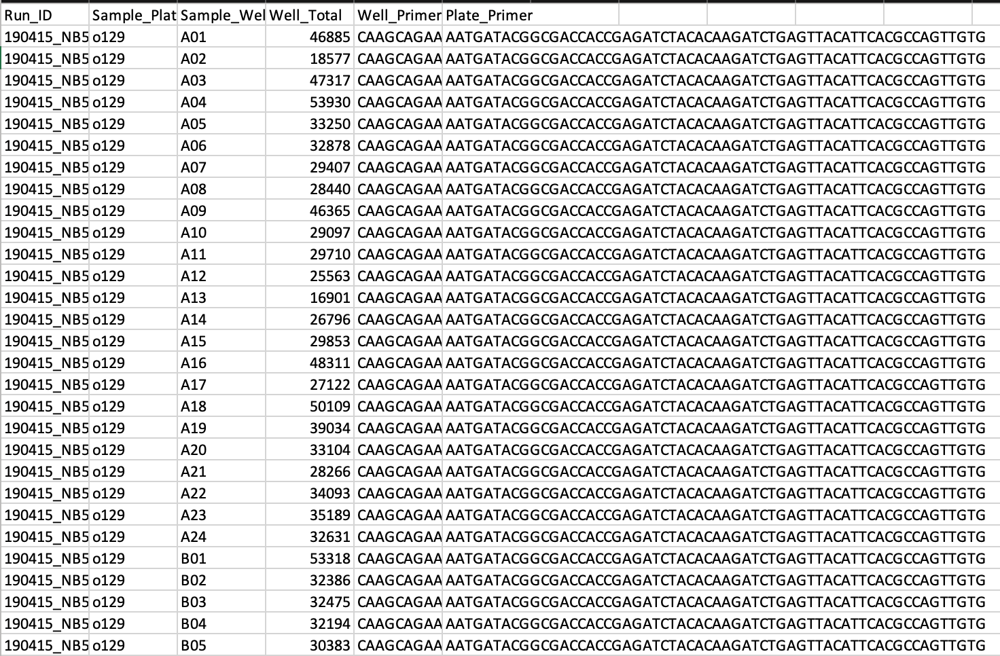
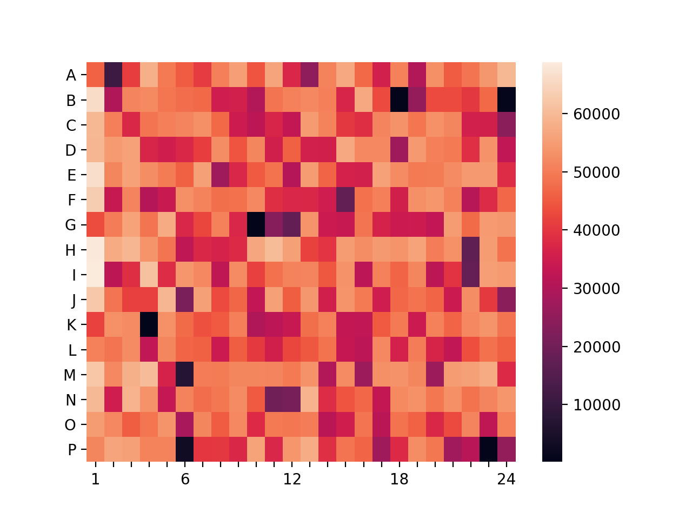

# Visualizing NGS Data
A visualization of 384-well plate next generation sequencing data to identify underrepresented wells.

## Install Dependencies
Python includes csv, string and Matplotlib by default.
For Seaborn:
```
$ pip install seaborn
```

## Data Snapshot


## Running the Script
```
$ python ngsDataVisualization.py
```

## Data Visualization Result

Wells B18, B24, G10, K04, P06, and P23 are most significantly underrepresented. Well M06 and, to a lesser extent, A02 might also be worth consideration.
